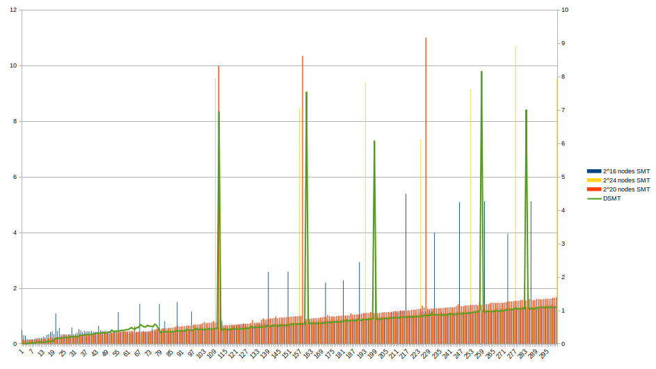
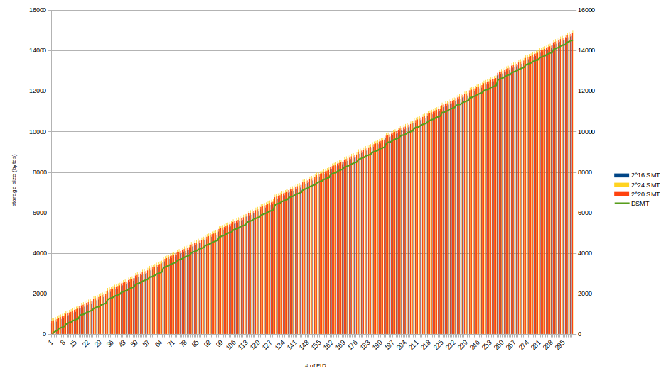

# MACPP

## Experiment Settings

- Intel i7-10700K 16GB RAM
- Ubuntu 20.04
- Nodejs v18.13.0

## crypto_ops

- `crypto_ops.js`: implementation of used cryptographic operations
- `crypto_ops_eval.log`: raw evaluation data

## DSMT

- `DSMT.js`: time cost and storage cost of SMT and DMST
- `DSMT_eval.[log|csv]`: raw evaluation data

